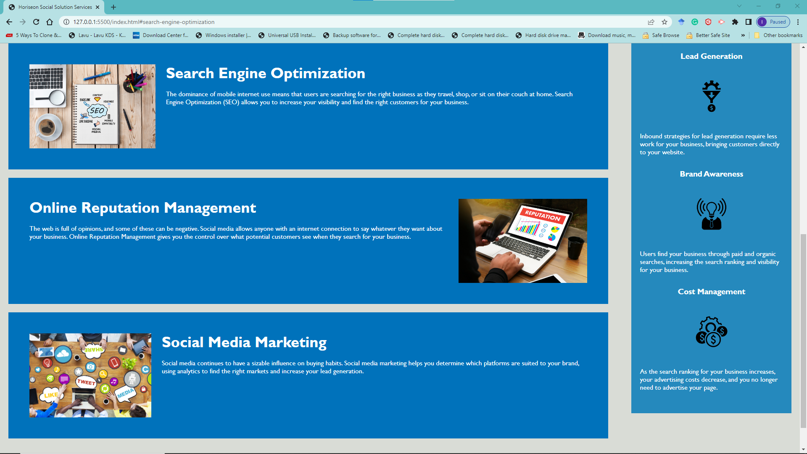
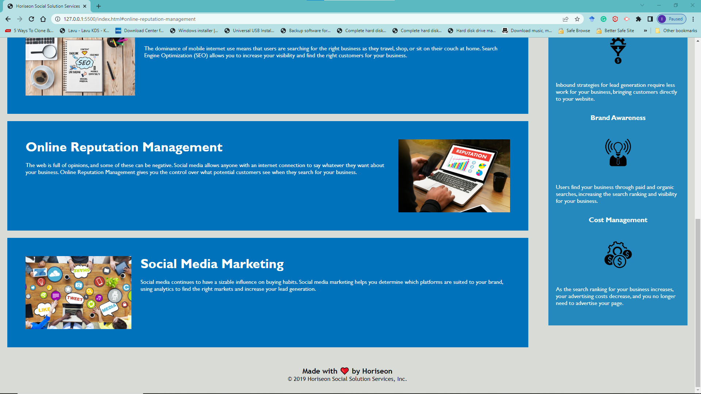

# Horiseon Social Solution Services

## Description

Horiseon Social Solution Services exists to assist their clients to improve their presence online through improved rankings on Search Engines, Online Reputation, and Social Media. It performs these tasks by providing Search Engine Optimization, Online Reputation Management, and Social Media Marketing services. The website code has improved features, such as:

- Meeting Accessibility standards,
- Structurally Reader friendly,
- Uses the appropriate semantic HTML elements,
- Has improved CSS efficiency by consolidated selectors and properties,
- Has appropriate comments before elements or sections of the page,
- Has all links working appropriately,
- Has a concise and descriptive title element,
- Its icons and images elements have accurately labeled alt attribute.
- Its HTML structure follows a logical structure independent of styling and positioning, etc.

## Installation

Visit https://ikubiti.github.io/horiseon-social-solution-services/

## Usage

Horiseon Social Solution Services webpage has three sections with shortcut links in its navigation bar. When a visitor clicks on any of these links will send the visitor to the requested section for more information.

The image below is the landing page a visitor gets when they enter the website address.

Clicking the "Search Engine Optimization" link presents the page below to the visitor.

Clicking the "Online Reputation Management" link presents the page below to the visitor.

Clicking the "Social Media Marketing" link presents the page below to the visitor.

## Credits

N/A

## License

Licensed under the [MIT](LICENSE.txt) license.
